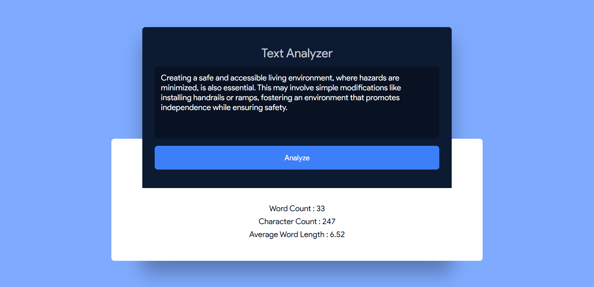

# Text Analyzer

Welcome to the Text Analyzer repository! This project is a JavaScript-based web application designed to analyze text input and provide information such as word count, character count, and average word count. Built with HTML, CSS, and JavaScript, it features a modern UI design for a seamless user experience.

## Preview



## Features

- **Word Count:** Calculate the total number of words in the provided text.
- **Character Count:** Determine the total number of characters in the input.
- **Average Word Count:** Compute the average word length in the text.
- **Modern UI Design:** Sleek layout and visually appealing design for an enjoyable user interface.

## Getting Started

To run the Text Analyzer locally, follow these steps:

1. Clone the repository to your local machine:

   ```bash
   git clone https://github.com/Devsethi3/Text-Analyzer.git
   ```

2. Open the `index.html` file in your preferred web browser.

## Usage

1. Enter or paste the text you want to analyze into the input area.
2. Click the "Analyze Text" button to see the results.
3. View the word count, character count, and average word count.

## Customization

Feel free to customize this project to fit your preferences. Update styles, colors, and layout in the HTML and CSS files. You can also extend the functionality to include additional features or customization options.

## Contributing

If you'd like to contribute to this project, please follow these steps:

1. Fork the repository.
2. Create a new branch for your feature or improvement.
3. Make your changes and commit them with descriptive messages.
4. Push your changes to your forked repository.
5. Open a pull request to merge your changes into the main branch.

Explore the Text Analyzer, analyze your text efficiently, and consider contributing to its development. Thank you for checking out the repository!